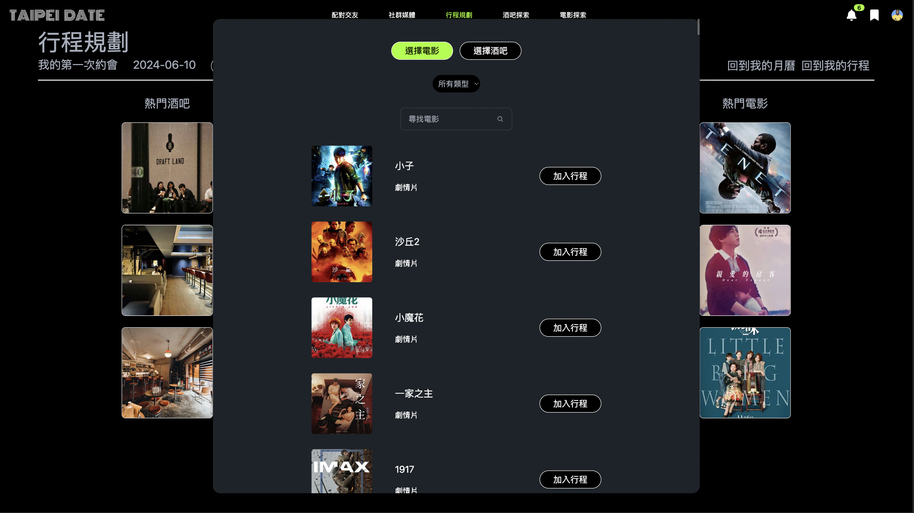

# Hi there 👋 我的名字叫沈睿哲，歡迎來到我的GitHub 
其他前端練習作品 : [React健身網頁](https://github.com/Shenrayjay/React.js-practice)、[JavaScript功能練習](https://github.com/Shenrayjay/Shenrayjay.github.io)、[Next.js功能練習](https://github.com/Shenrayjay/Next.js-practice)
## 這裡是我在資展國際前端工程師就業養成班所製作的期末專題的畫面展示  
Taipei Date 是一個以興趣為導向的交友軟體，其中包括了配對交友、社群媒體、行程規劃以及電影和酒吧探索。  
前端所使用的技術為：Next.js、daisyUI、tailwindcss  
後端所使用的技術為：node.js  
我所負責的是行程規劃的部分：  
  
使用者一進到頁面可以看到屬於自己的專屬月曆，可以透過點擊日期幫當天添加行程。  
  
  

  
到"我的行程"頁面，在沒有規劃任何行程時，系統會自動推薦使用者5個其他使用者分享的行程。  
  

  
點擊新增行程，並選擇日期(只能選擇今天之後的日期)，填入行程名稱，就可以順利新增一個專屬行程了。  
  

  
進入到新增的行程後，使用者可以從早中晚三個時段添加電影或是酒吧，使用者可以用關鍵字搜尋或是分類篩選來更快找到想要的電影和酒吧，也可以從左右兩邊的熱門輪播新增活動。使用者也可以透過上方的按鈕分享自己的行程、為行程添加筆記和說明以及添加行程封面。   

  
  
添加完喜歡的電影和酒吧後就成功建立第一個自己的行程囉，這個行程會出現在"我的月曆"以及"我的行程"的頁面上。

來到"其他人的分享"可以看到其他使用者所分享的行程，使用者可以利用關鍵字搜尋來快速找到想要的行程。  

點擊檢視行程可以看到其他使用者對於行程的規劃以及對於行程的描述，若是使用者喜歡這個行程，可以點擊"加入我的月曆"，這樣就可以複製這個行程的編排了，並且它會出現在"我的月曆"和"我的行程"頁面。  

